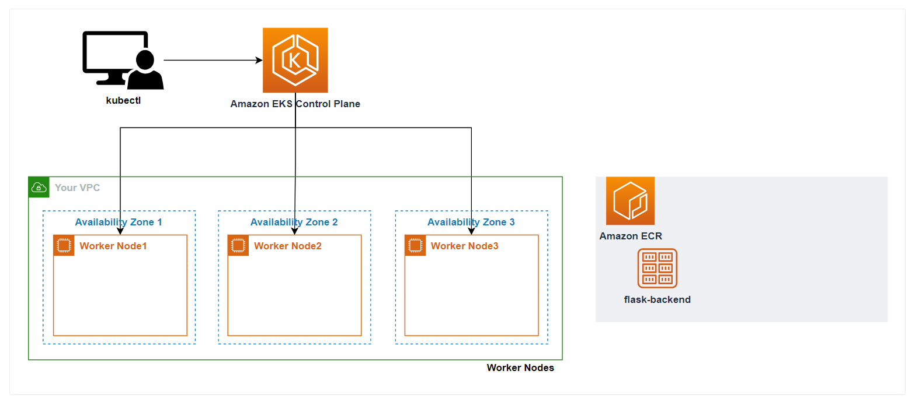

# Kubernetes

Container Orchestrator
- Scheduling
- Self Healing
- Load Balancing
- Auto Scaling
- Rolling Update
- Portability

Container Orchestration Tool
- Docker Swarm
- Kubernetes
- ...

Kubernetes Cluster

- Master Node
    - Controller Manager
    - Scheduler
    - etcd (key-value 저장소)
- Worker Node
    - Kubelet (Node 상태 전달)
    - Kube-Proxy (네트워크)
    - Pod (1개 이상의 컨테이너)

Overlay Networking
- Node 간의 같은 IP를 써서 연결이 되지 않는 것을 방지하기 위하여 사용하는 기술 < ??

EKS
- Kubernetes 기반의 AWS 서비스
- Kubernetes 소스를 그대로 활용 (커스텀 X)

Scaler
- Cluster Auto Scaler (CA) : 과부하가 일어날 때 설정된 maximum까지 node가 자동으로 늘어난다.
- Horizontal Pod Auto Scaler (HPA)
- Karptener : 자동으로 node가 줄고 늘어난다.